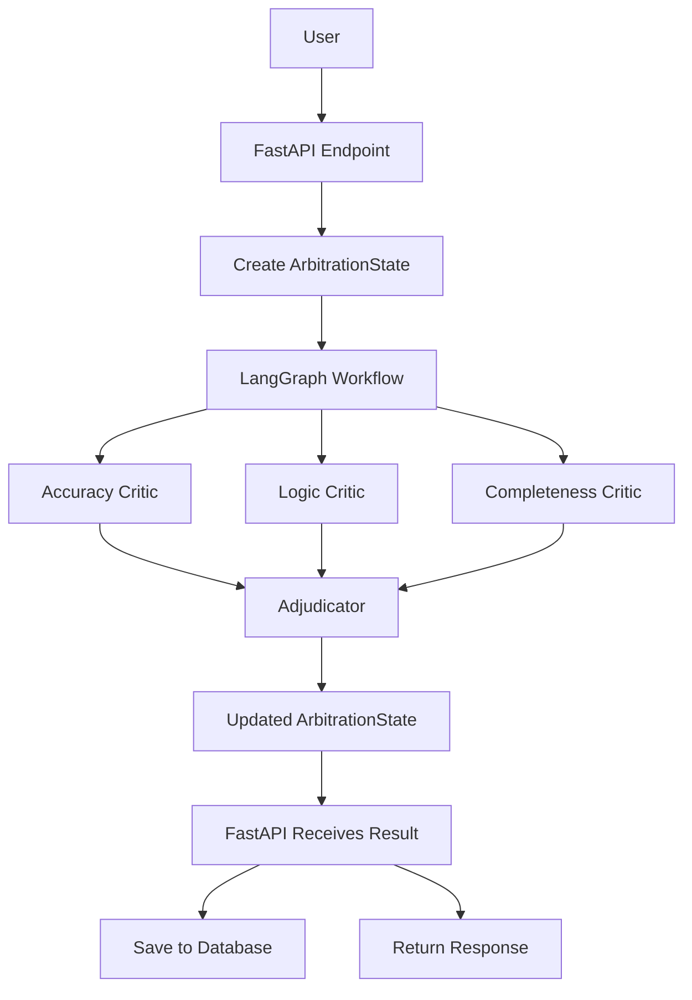

# 🏛️ LLM Output Arbitration System - Architecture

## Overview

The LLM Output Arbitration System is a multi-agent AI application designed to evaluate the quality of Large Language Model (LLM) responses.

Instead of relying on a single evaluation, multiple specialized AI critic agents independently analyze the same response from different perspectives. Their findings are then synthesized by an Adjudicator Agent, producing a final verdict along with confidence scores and actionable feedback.

The system follows a layered architecture to separate concerns and improve maintainability.

---

# High-Level Architecture

# System Layers

## 1. Presentation Layer

Responsible for interacting with the user.

Components:

- React / Next.js Frontend
- API documentation (Swagger)

Responsibilities:

- Collect user input
- Display evaluation results
- Visualize analytics
- Show critic reports

---

## 2. API Layer

Implemented using FastAPI.

Responsibilities:

- Validate incoming requests
- Create the initial ArbitrationState
- Invoke the LangGraph workflow
- Persist completed evaluations
- Return API responses

The API layer should contain **no evaluation logic**.

---

## 3. Workflow Layer

Implemented using LangGraph.

This is the heart of the application.

Responsibilities:

- Execute critic agents
- Manage execution flow
- Synchronize parallel branches
- Invoke the Adjudicator Agent

The workflow knows nothing about:

- databases
- frontend
- HTTP
- authentication

It only transforms state.

---

## 4. AI Layer

Implemented using Gemini.

Each AI agent has a single responsibility.

Current agents:

- Accuracy Critic
- Logic Critic
- Completeness Critic
- Adjudicator

Future agents:

- Citation Critic
- Toxicity Critic
- Bias Critic
- Style Critic

---

## 5. Persistence Layer

SQLite (later PostgreSQL)

Responsibilities:

- Store evaluations
- Store scores
- Store timestamps
- Store analytics

The database should never be accessed directly by LangGraph nodes.

---

# ArbitrationState

Every LangGraph node receives the same shared state.

Initially:

{
    prompt,
    response
}

After Accuracy Critic:

{
    prompt,
    response,
    accuracy_result
}

After Logic Critic:

{
    prompt,
    response,
    accuracy_result,
    logic_result
}

After Completeness Critic:

{
    prompt,
    response,
    accuracy_result,
    logic_result,
    completeness_result
}

After Adjudicator:

{
    prompt,
    response,
    accuracy_result,
    logic_result,
    completeness_result,
    final_verdict
}

---

# Critic Responsibilities

## Accuracy Critic

Checks:

- factual correctness
- hallucinations
- unsupported claims

Returns:

- score
- issues
- reasoning

---

## Logic Critic

Checks:

- logical consistency
- contradictions
- invalid reasoning

Returns:

- score
- issues
- reasoning

---

## Completeness Critic

Checks:

- whether every part of the prompt was answered

Returns:

- score
- missing information
- reasoning

---

## Adjudicator

Receives:

- original prompt
- original response
- all critic reports

Produces:

- overall score
- confidence score
- summary
- confirmed issues
- recommendations

---

# Design Principles

- Single Responsibility Principle
- Separation of Concerns
- Stateless API Layer
- Shared Workflow State
- Modular AI Agents
- Provider Abstraction
- Extensible Architecture

---

# Future Improvements

- Multi-model critics
- Human feedback integration
- Citation verification
- Batch evaluation
- Streaming support
- Authentication
- Analytics dashboard
- Docker deployment
- Kubernetes deployment